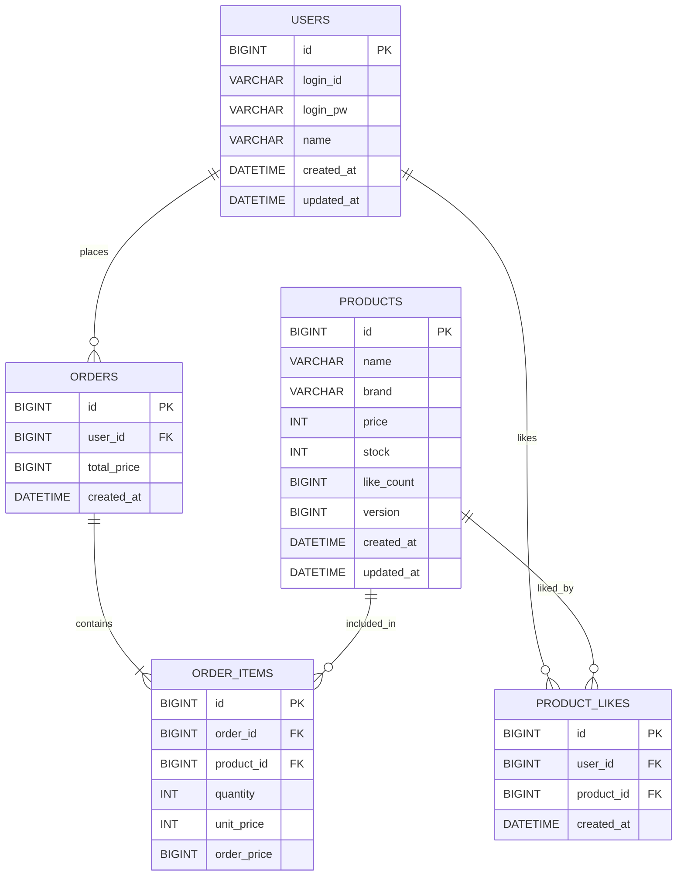

# Huuim Ecommerce API


휴이엠 과제용 이커머스 API 프로젝트 입니다.  
상품, 좋아요, 주문 서비스를 Spring Boot 기반으로 구현했습니다.

## 1. 기술 스택

- Java
- Spring Boot
- Spring Data JPA
- MySQL
- Maven

테스트는 테스트용 컨트롤러 및 POSTMAN을 사용하여 진행하였습니다.

## 2. 주요 기능

- 회원가입
- 상품 등록 및 조회
- 상품 좋아요 등록/취소 (멱등성 처리)
- 주문 생성 (다중 상품 주문 가능)

```text

1. 회원가입

Method: POST
URI: /api/v1/users

Request
{
  "loginId": "huuim1",
  "loginPw": "huuim1124",
  "name": "김민희"
}

Response 예시
{
  "id": 1,
  "loginId": "huuim1",
  "name": "김민희",
  "createdAt": "2026-03-20T21:10:00"
};

//.\mvnw.cmd -Dtest=UserControllerTest test
// mvn -Dtest=UserControllerTest test

2. 상품 등록

Method: POST
URI: /api/v1/products

Headers
X-Huuim-LoginId: huuim1
X-Huuim-LoginPw: huuim1124
Content-Type: application/json

Request
{
  "name": "웰컴 투 휴이엠 모이스처 밤 (100ml)",
  "brand": "NIKE",
  "price": 24000,
  "stock": 10
}
Response 예시
{
  "id": 1,
  "name": "웰컴 투 휴이엠 모이스처 밤 (100ml)",
  "brand": "NIKE",
  "price": 24000,
  "stock": 10,
  "likeCount": 0,
  "createdAt": "2026-03-20T21:20:00"
}

3. 상품 목록 조회

Method: GET
URI: /api/v1/products

sort: latest / price_asc / likes_desc
page: 기본값 0
size: 기본값 20

호출 예시
GET /api/v1/products
GET /api/v1/products?sort=latest&page=0&size=20

상품 목록 조회 - 가격 오름차순
GET api/v1/products?sort=price_asc&page=0&size=20

상품 목록 조회 - 좋아요 많은 순
GET api/v1/products?sort=likes_desc&page=0&size=20

// .\mvnw.cmd -Dtest=ProductControllerTest test
// mvn -Dtest=ProductControllerTest test


4-1. 상품 좋아요 등록
POST http://localhost:8082/api/v1/products/1/likes
X-Huuim-LoginId: user1
X-Huuim-LoginPw: 1234

body : x

성공시:

{
  "productId": 1,
  "likeCount": 1,
  "liked": true,
  "message": "좋아요가 등록되었습니다."
}

같은요청시:

{
  "productId": 1,
  "likeCount": 1,
  "liked": true,
  "message": "좋아요가 등록되었습니다."
}

4-2. 상품 좋아요 취소

DELETE http://localhost:8082/api/v1/products/1/likes
X-Huuim-LoginId: user1
X-Huuim-LoginPw: 1234

body : x


성공시:

{
  "productId": 1,
  "likeCount": 0,
  "liked": false,
  "message": "좋아요가 취소되었습니다."
}

같은요청시:

{
  "productId": 1,
  "likeCount": 0,
  "liked": false,
  "message": "이미 좋아요가 취소된 상태입니다."
}


- 내가 눌렀던 좋아요만 취소 가능
- 좋아요 취소 시 상품의 likeCount가 1 감소
- 이미 좋아요가 없는 상태에서 다시 취소 요청해도 에러를 내지 않고 멱등하게 처리
- 동시성 이슈 대응을 위해 Product 엔티티에 낙관적 락(`@Version`)을 적용

좋아요 API의 liked 필드는
요청 처리 이후의 현재 좋아요 상태를 의미하도록 정의했습니다.

이미 좋아요한 상품에 다시 좋아요 요청해도 liked=true
이미 좋아요가 없는 상품에 다시 취소 요청해도 liked=false

// .\mvnw.cmd -Dtest=ProductLikeControllerTest test
// mvn -Dtest=ProductLikeControllerTest test

5. 주문 요청
Method: POST
URI: /api/v1/orders
X-Huuim-LoginId: user1
X-Huuim-LoginPw: 1234
Content-Type: application/json

body : 
{
  "items": [
    {
      "productId": 1,
      "quantity": 2
    },
    {
      "productId": 18,
      "quantity": 1
    }
  ]
}

성공시 : 
{
    "orderId": 2,
    "userId": 1,
    "totalPrice": 84 000,
    "createdAt": "2026-03-21T23:29:06.5595971",
    "items": [
        {
            "productId": 1,
            "productName": "웰컴 투 휴이엠 모이스처 밤 (100ml)",
            "quantity": 2,
            "unitPrice": 24000,
            "orderPrice": 48000
        },
        {
            "productId": 18,
            "productName": "웰컴 투 휴이엠 샴푸 1000m",
            "quantity": 1,
            "unitPrice": 36000,
            "orderPrice": 36000
        }
    ]
}

없는 상품 주문시 : {
    "timestamp": "2026-03-21T23:29:50.4263961",
    "status": 400,
    "message": "해당 상품을 찾을 수 없습니다. productId = 17"
}

//.\mvnw.cmd -Dtest=OrderControllerTest test
//mvn -Dtest=OrderControllerTest test

5개 요청 → 3개 성공, 2개 실패 검증 완료
```

## 동시성

주문 시 상품을 PESSIMISTIC_WRITE 락으로 조회
동시에 같은 상품을 주문해도 재고 정합성이 깨지지 않도록 처리

## 일관성

주문 생성과 재고 차감을 하나의 트랜잭션으로 묶음
중간 실패 시 전체 롤백

## 멱등성

현재는 명시적 idempotency key는 없지만,
구조상 추후 Idempotency-Key 헤더로 확장 가능


## 3. 테스트
Controller 테스트
동시성 테스트 (멀티 스레드)

.\mvnw.cmd test 또는 mvn test


## 4. ERD


###  관계 설명

- User 1명은 여러 개의 Order를 가진다.
- User 1명은 여러 상품에 좋아요를 누를 수 있다.
- Product 1개는 여러 사용자에게 좋아요를 받을 수 있다.
- Order 1건은 여러 개의 OrderItem을 가질 수 있다.
- OrderItem은 주문 시점의 상품 가격과 수량을 별도로 저장


## 5. 프로젝트구조
```text
src
├─ main
│  ├─ java
│  │  └─ com
│  │     └─ huuim
│  │        └─ ecommerce
│  │           ├─ common
│  │           │  ├─ auth
│  │           │  │  └─ AuthService.java
│  │           │  └─ exception
│  │           │     └─ GlobalExceptionHandler.java
│  │           ├─ controller
│  │           │  ├─ UserController.java
│  │           │  ├─ ProductController.java
│  │           │  ├─ ProductLikeController.java
│  │           │  └─ OrderController.java
│  │           ├─ domain
│  │           │  ├─ user
│  │           │  │  └─ User.java
│  │           │  ├─ product
│  │           │  │  └─ Product.java
│  │           │  ├─ like
│  │           │  │  └─ ProductLike.java
│  │           │  └─ order
│  │           │     ├─ Order.java
│  │           │     └─ OrderItem.java
│  │           ├─ dto
│  │           │  ├─ user
│  │           │  │  ├─ UserCreateRequest.java
│  │           │  │  └─ UserResponse.java
│  │           │  ├─ product
│  │           │  │  ├─ ProductCreateRequest.java
│  │           │  │  ├─ ProductResponse.java
│  │           │  │  └─ ProductListResponse.java
│  │           │  ├─ like
│  │           │  │  └─ ProductLikeResponse.java
│  │           │  └─ order
│  │           │     ├─ OrderCreateRequest.java
│  │           │     ├─ OrderCreateItemRequest.java
│  │           │     ├─ OrderResponse.java
│  │           │     └─ OrderItemResponse.java
│  │           ├─ repository
│  │           │  ├─ UserRepository.java
│  │           │  ├─ ProductRepository.java
│  │           │  ├─ ProductLikeRepository.java
│  │           │  ├─ OrderRepository.java
│  │           │  └─ OrderItemRepository.java
│  │           ├─ service
│  │           │  ├─ UserService.java
│  │           │  ├─ ProductService.java
│  │           │  ├─ ProductLikeService.java
│  │           │  └─ OrderService.java
│  │           └─ EcommerceApplication.java
│  └─ resources
│     └─ application.yml
└─ test
   └─ java
      └─ com
         └─ huuim
            └─ ecommerce
               ├─ controller
               │  ├─ UserControllerTest.java
               │  ├─ ProductControllerTest.java
               │  ├─ ProductLikeControllerTest.java
               │  └─ OrderControllerTest.java
               └─ service
                  └─ OrderServiceConcurrencyTest.java
```

### 구조 설명

- `controller` : API 요청/응답 처리
- `service` : 비즈니스 로직 처리
- `repository` : DB 접근 계층
- `domain` : 엔티티 클래스
- `dto` : Request/Response 객체
- `common` : 인증, 예외 처리 등 공통 기능

## 7. 기술 고려사항

과제 요구사항에 따라 아래 항목을 고려하여 구현합니다.
동시성: 좋아요 수, 재고 처리 시 동시 요청 고려
멱등성: 중복 좋아요, 중복 주문 처리 고려
일관성: 주문 처리 시 재고 및 주문 데이터 정합성 유지
느린 조회: 상품 목록 조회 시 정렬/페이징 및 인덱스 고려
동시 주문: 동시에 여러 주문 요청이 들어와도 재고가 정확히 차감되도록 설계

본 과제에서는 ChatGPT, Claude 및 Gemini를 활용했습니다.

활용 내용:
Spring Boot 프로젝트 구조 설계 보조
API 엔드포인트/DTO/서비스 계층 예시 코드 작성 보조